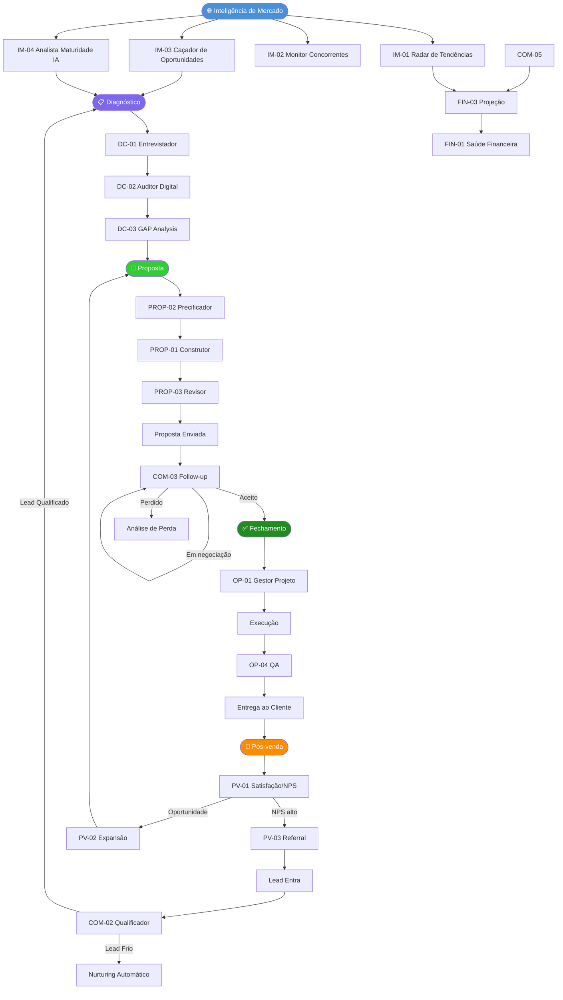
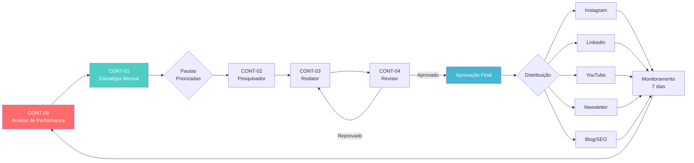
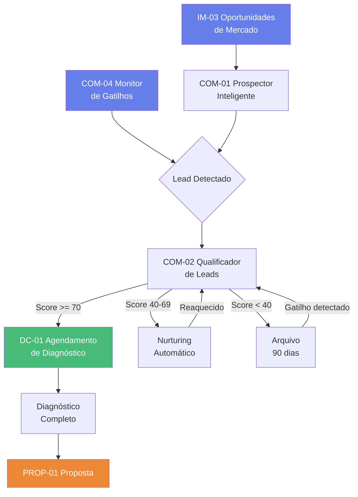
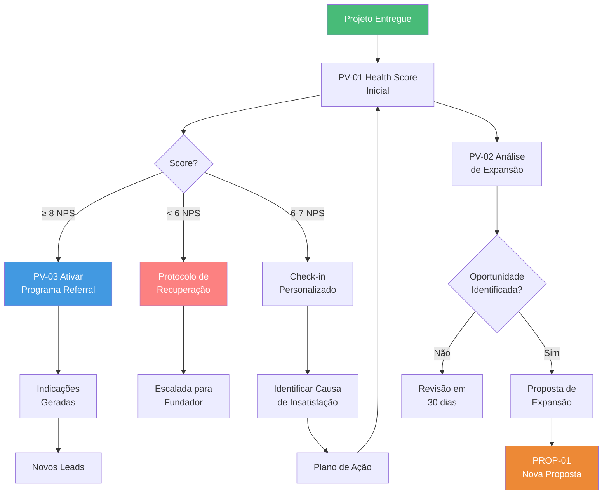
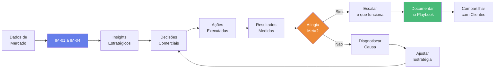
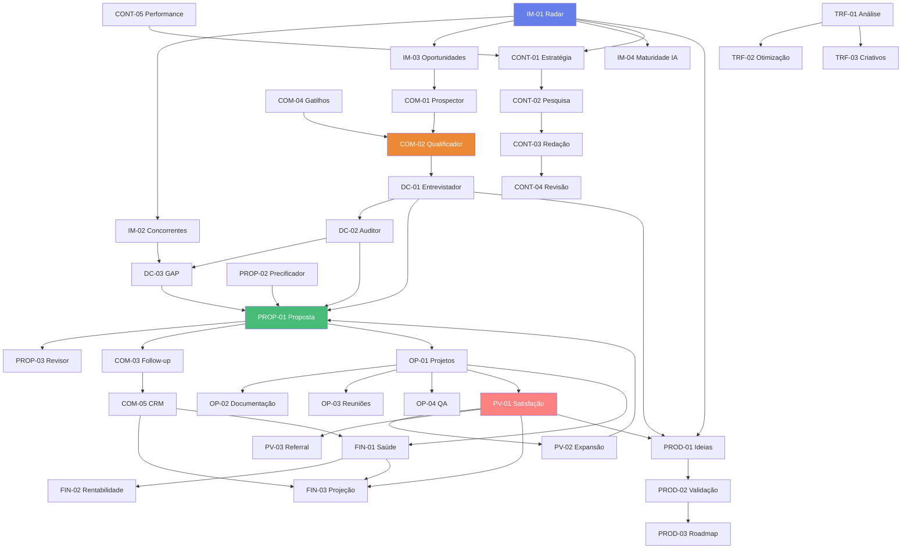

# Fase 3 — Fluxos e Workflows

> Diagramas completos dos fluxos de operação. Começando pelo fluxo que gera dinheiro.

---

## Fluxo 1 — Fluxo Principal de Receita (Prioridade Máxima)

### Descrição Textual

```
[INTELIGÊNCIA DE MERCADO]
       ↓
Radar de Tendências + Monitor de Concorrentes + Caçador de Oportunidades
       ↓
[DIAGNÓSTICO]
       ↓
Lead entra → Qualificação → Entrevista de Diagnóstico → Auditoria Digital → GAP Analysis
       ↓
[COMERCIAL]
       ↓
Prospecção ativa + Monitor de Gatilhos → Qualificação → Follow-up → CRM atualizado
       ↓
[PROPOSTA]
       ↓
Precificação → Construção → Revisão → Envio → Follow-up de proposta
       ↓
[FECHAMENTO]
       ↓
Contrato assinado → Kickoff → Gestão de Projeto
       ↓
[ENTREGA]
       ↓
Execução → QA → Entrega → Relatório
       ↓
[PÓS-VENDA]
       ↓
NPS → Health Score → Expansão → Referral
```

---

### Diagrama Mermaid — Fluxo de Receita



---

## Fluxo 2 — Fluxo de Conteúdo

### Descrição Textual

```
Análise de Performance Anterior
       ↓
Estratégia Mensal
       ↓
Pesquisa de Pauta (x N pautas)
       ↓
Redação
       ↓
Revisão Editorial
       ↓
Aprovação
       ↓
Distribuição por Canal
       ↓
Monitoramento de Performance
       ↓
→ (retroalimenta Estratégia)
```

### Diagrama Mermaid — Fluxo de Conteúdo



---

## Fluxo 3 — Fluxo de Prospecção Inteligente

### Diagrama Mermaid



---

## Fluxo 4 — Fluxo de Pós-venda e Expansão

### Diagrama Mermaid



---

## Fluxo 5 — Fluxo de Inteligência Contínua (Loop de Aprendizado)



---

## Fluxo 6 — Fluxo Operacional Diário (Rotina de Agentes)

```
MANHÃ (7h–9h)
├── IM-01: Entrega briefing de tendências da semana
├── COM-04: Alerta de gatilhos de compra detectados
├── COM-03: Lista de follow-ups do dia
└── OP-01: Status dos projetos em andamento

DURANTE O DIA
├── COM-02: Qualifica novos leads entrantes
├── OP-03: Transcreve e resume reuniões realizadas
└── TRF-01: Monitora alertas de campanhas (CPL > limite, ROAS < mínimo)

FINAL DO DIA (17h–18h)
├── COM-05: Atualiza pipeline e destaca deals em risco
└── OP-04: Lista entregas que precisam de QA amanhã

SEMANAL (segunda-feira)
├── IM-01: Briefing semanal de mercado
├── TRF-01: Relatório de performance de mídia
└── FIN-01: Dashboard financeiro da semana

MENSAL (dia 1)
├── CONT-01: Estratégia de conteúdo do mês
├── PV-02: Oportunidades de expansão na base
├── FIN-02: Rentabilidade por cliente
└── FIN-03: Projeção de receita para os próximos 3 meses
```

---

## Mapa de Dependências entre Agentes


